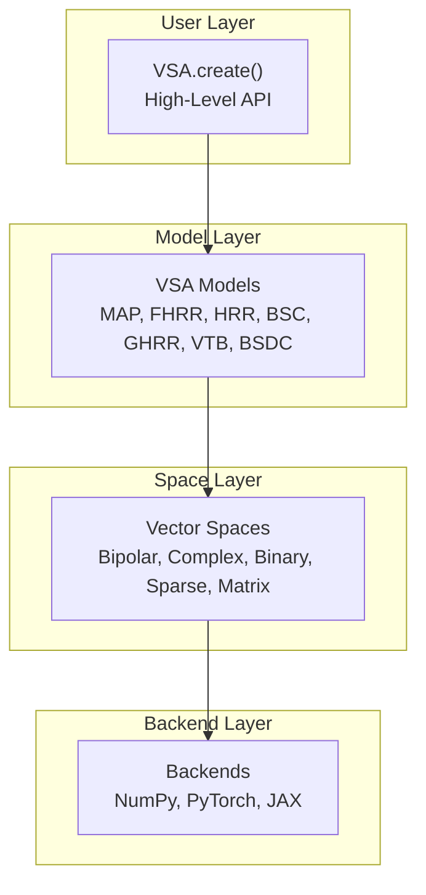
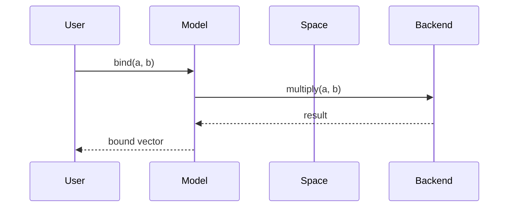
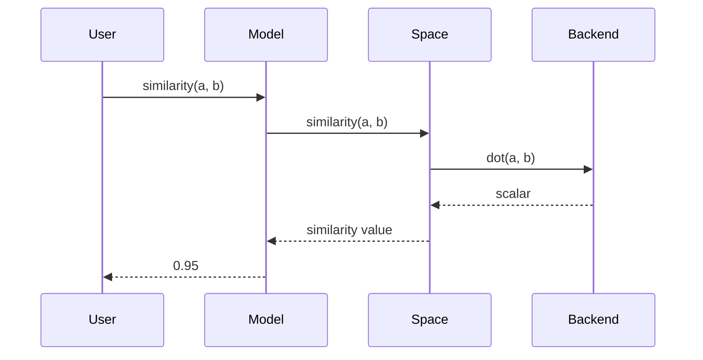

HoloVec follows a clean, layered architecture that separates concerns and enables flexibility across computational backends.

## Layered Design



Each layer has a single responsibility:

| Layer | Responsibility |
|-------|----------------|
| **API** | Factory methods, user convenience |
| **Models** | Algebraic operations (bind, bundle, permute) |
| **Spaces** | Random generation, similarity measures |
| **Backends** | Numerical primitives, hardware acceleration |

## Information Flow

When you call `model.bind(a, b)`:



When you call `model.similarity(a, b)`:



## Module Structure

```
holovec/
├── __init__.py           # VSA class, factory method
├── backends/
│   ├── base.py           # Abstract Backend interface
│   ├── numpy_backend.py  # NumPy implementation
│   ├── torch_backend.py  # PyTorch implementation
│   └── jax_backend.py    # JAX implementation
├── spaces/
│   ├── base.py           # Abstract VectorSpace interface
│   └── spaces.py         # Bipolar, Complex, Binary, etc.
├── models/
│   ├── base.py           # Abstract VSAModel interface
│   ├── map.py            # MAP model
│   ├── fhrr.py           # FHRR model
│   ├── hrr.py            # HRR model
│   ├── bsc.py            # BSC model
│   ├── bsdc.py           # BSDC model
│   ├── bsdc_seg.py       # BSDC-SEG model
│   ├── ghrr.py           # GHRR model
│   └── vtb.py            # VTB model
├── encoders/
│   ├── scalar.py         # FPE, Thermometer, Level
│   ├── sequence.py       # Position, NGram, Trajectory
│   ├── structured.py     # VectorEncoder
│   └── spatial.py        # ImageEncoder
├── retrieval/
│   ├── codebook.py       # Label-vector mapping
│   ├── itemstore.py      # High-level retrieval
│   └── assocstore.py     # Associative memory
└── utils/
    ├── cleanup.py        # BruteForce, Resonator
    ├── search.py         # K-NN, threshold search
    └── operations.py     # Top-k, noise, similarity matrix
```

## Key Design Decisions

### Backend Abstraction

All numerical operations go through the backend interface. Models never call NumPy/PyTorch/JAX directly:

```python
# Correct: Use backend methods
result = self.backend.multiply(a, b)
result = self.backend.fft(vector)

# Incorrect: Direct library calls
result = np.multiply(a, b)  # Breaks abstraction
```

This enables:
- Backend switching without code changes
- Consistent behavior across platforms
- Easy addition of new backends

### Model-Space Separation

Models delegate random generation and similarity to their associated space:

```python
class VSAModel:
    def random(self, seed=None):
        return self.space.random(seed=seed)  # Delegated

    def similarity(self, a, b):
        return self.space.similarity(a, b)  # Delegated
```

This allows:
- Same model logic with different vector types
- Clear mathematical semantics per space
- Testable similarity invariants

### Factory Pattern

`VSA.create()` handles the complexity of coordinating backends, spaces, and models:

```python
model = VSA.create('FHRR', dim=2048, backend='torch', device='cuda')
# Internally:
# 1. Creates TorchBackend(device='cuda')
# 2. Creates ComplexSpace(dim=2048, backend=torch_backend)
# 3. Creates FHRRModel(space=complex_space)
```

## Extension Points

### Adding a New Model

1. Create `holovec/models/mymodel.py`
2. Inherit from `VSAModel`
3. Implement: `bind()`, `unbind()`, `bundle()`, `permute()`, `unpermute()`
4. Register in `VSA._MODELS`

### Adding a New Backend

1. Create `holovec/backends/mybackend_backend.py`
2. Inherit from `Backend`
3. Implement all abstract methods
4. Add capability detection methods

### Adding a New Encoder

1. Choose appropriate file: `scalar.py`, `sequence.py`, etc.
2. Inherit from base encoder class
3. Implement `encode()` (and optionally `decode()`)

## See Also

- [Backends](../architecture/backends.md) — Detailed backend documentation
- [Spaces](../architecture/spaces.md) — Vector space mathematics
- [Models](../models/index.md) — Model comparison and selection
