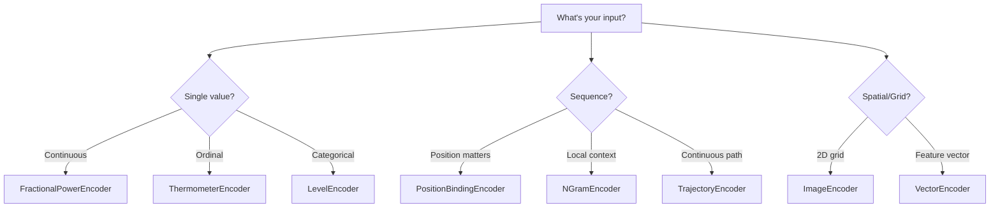

Encoders transform real-world data into hypervectors. Each encoder is designed for a specific data type while preserving relevant properties like locality, order, or structure.

## Encoder Categories

| Category | Encoders | Input Type | Key Property |
|----------|----------|------------|--------------|
| **Scalar** | FPE, Thermometer, Level | Numbers | Locality preservation |
| **Sequence** | Position, NGram, Trajectory | Lists | Order preservation |
| **Spatial** | Image, Vector | 2D/Multi-dim | Spatial relationships |

## Choosing an Encoder



## Quick Reference

### Scalar Encoders

| Encoder | Best For | Similarity Behavior |
|---------|----------|---------------------|
| [FractionalPowerEncoder](../encoders/fractional-power.md) | Continuous values, sensor data | Linear: sim(5, 6) > sim(5, 10) |
| [ThermometerEncoder](../encoders/thermometer-level.md) | Ordinal rankings | Monotonic: sim(1,2) > sim(1,3) |
| [LevelEncoder](../encoders/thermometer-level.md) | Discrete categories | All pairs orthogonal |

### Sequence Encoders

| Encoder | Best For | Preserves |
|---------|----------|-----------|
| [PositionBindingEncoder](../encoders/sequence.md) | Fixed-length sequences | Absolute position |
| [NGramEncoder](../encoders/sequence.md) | Text, variable sequences | Local context |
| [TrajectoryEncoder](../encoders/sequence.md) | Paths, time series | Temporal order |

### Spatial Encoders

| Encoder | Best For | Preserves |
|---------|----------|-----------|
| [ImageEncoder](../encoders/spatial.md) | Images, 2D grids | 2D position |
| [VectorEncoder](../encoders/spatial.md) | Feature vectors | Per-dimension info |

## Common Usage Pattern

```python
from holovec import VSA
from holovec.encoders import FractionalPowerEncoder

# Create model and encoder
model = VSA.create('FHRR', dim=2048)
encoder = FractionalPowerEncoder(model, min_val=0, max_val=100)

# Encode values
v50 = encoder.encode(50)
v55 = encoder.encode(55)
v90 = encoder.encode(90)

# Check similarity preservation
print(model.similarity(v50, v55))  # ~0.95 (close values)
print(model.similarity(v50, v90))  # ~0.60 (distant values)
```

## Encoder Properties

### Locality Preservation

Values that are "close" in the input space should produce similar hypervectors.

```python
# FPE preserves locality
sim_close = model.similarity(encoder.encode(50), encoder.encode(51))
sim_far = model.similarity(encoder.encode(50), encoder.encode(100))
assert sim_close > sim_far  # Closer values = higher similarity
```

### Composability

Encoders can be combined to encode complex structures:

```python
# Encode a record: {x: 50, y: 75}
x_enc = FractionalPowerEncoder(model, min_val=0, max_val=100)
y_enc = FractionalPowerEncoder(model, min_val=0, max_val=100)

ROLE_x = model.random(seed=1)
ROLE_y = model.random(seed=2)

record = model.bundle([
    model.bind(ROLE_x, x_enc.encode(50)),
    model.bind(ROLE_y, y_enc.encode(75))
])
```

### Model Compatibility

All encoders work with any VSA model:

```python
# Same encoder, different models
for model_name in ['FHRR', 'MAP', 'HRR']:
    model = VSA.create(model_name, dim=2048)
    encoder = FractionalPowerEncoder(model, min_val=0, max_val=100)
    v = encoder.encode(50)
```

## Decoding

Some encoders support decoding (recovering the original value):

```python
# Encode
v = encoder.encode(50)

# Decode (requires codebook)
decoded = encoder.decode(v)
print(decoded)  # ~50
```

Decoding accuracy depends on:
- Encoder type (FPE is more accurate than Thermometer)
- Codebook resolution
- Noise level

## See Also

- [Encoder-FractionalPower](../encoders/fractional-power.md) — Continuous values
- [Encoder-Thermometer-Level](../encoders/thermometer-level.md) — Ordinal and discrete
- [Encoder-Sequence](../encoders/sequence.md) — Sequences and text
- [Encoder-Spatial](../encoders/spatial.md) — Images and feature vectors
