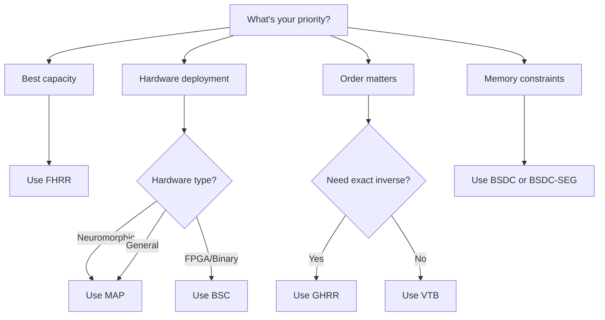

HoloVec implements 8 VSA models, each with different algebraic properties suited to different use cases.

## Model Comparison

| Model | Binding | Inverse | Commutative | Space | Best For |
|-------|---------|---------|-------------|-------|----------|
| [FHRR](../models/fhrr.md) | Complex multiply | Exact | Yes | Complex | General use, best capacity |
| [GHRR](../models/ghrr.md) | Matrix product | Exact | No | Matrix | Order-sensitive relations |
| [MAP](../models/map.md) | Element multiply | Self | Yes | Bipolar | Hardware, neuromorphic |
| [HRR](../models/hrr.md) | Circular convolution | Approx | Yes | Bipolar | Classic baseline |
| [VTB](../models/vtb.md) | Matrix transform | Approx | No | Matrix | Directional binding |
| [BSC](../models/bsc.md) | XOR | Self | Yes | Binary | FPGA, low power |
| [BSDC](../models/bsdc.md) | Sparse XOR | Approx | Yes | Sparse | Memory efficient |
| [BSDC-SEG](../models/bsdc-seg.md) | Segment XOR | Self | Yes | Sparse Segment | Fast sparse search |

## Choosing a Model



### Quick Decision Guide

| Scenario | Recommended |
|----------|-------------|
| Default choice / don't know | **FHRR** |
| Neuromorphic hardware | **MAP** |
| FPGA or binary operations | **BSC** |
| Memory-constrained | **BSDC** |
| Order-sensitive relationships | **GHRR** |
| Academic comparison baseline | **HRR** |
| Directional associations | **VTB** |
| Fast sparse retrieval | **BSDC-SEG** |

## Inverse Types

### Exact Inverse

The original vector is perfectly recovered:

```python
model = VSA.create('FHRR', dim=2048)
a, b = model.random(), model.random()
c = model.bind(a, b)
a_recovered = model.unbind(c, b)
print(model.similarity(a, a_recovered))  # 1.0
```

**Models:** FHRR, GHRR

### Self-Inverse

Binding a vector with itself returns the identity:

```python
model = VSA.create('MAP', dim=2048)
a, b = model.random(), model.random()
c = model.bind(a, b)
# Unbind by binding again with b
a_recovered = model.bind(c, b)
print(model.similarity(a, a_recovered))  # 1.0
```

**Models:** MAP, BSC, BSDC-SEG

### Approximate Inverse

Recovery is imperfect but sufficient for cleanup:

```python
model = VSA.create('HRR', dim=2048)
a, b = model.random(), model.random()
c = model.bind(a, b)
a_recovered = model.unbind(c, b)
print(model.similarity(a, a_recovered))  # ~0.65-0.75
```

**Models:** HRR, VTB, BSDC

## Commutativity

### Commutative

Order doesn't matter: `bind(a, b) = bind(b, a)`

```python
model = VSA.create('FHRR', dim=2048)
a, b = model.random(), model.random()
c1 = model.bind(a, b)
c2 = model.bind(b, a)
print(model.similarity(c1, c2))  # 1.0
```

**Models:** FHRR, MAP, HRR, BSC, BSDC, BSDC-SEG

### Non-Commutative

Order matters: `bind(a, b) ≠ bind(b, a)`

```python
model = VSA.create('GHRR', dim=64)  # GHRR uses smaller dims
a, b = model.random(), model.random()
c1 = model.bind(a, b)
c2 = model.bind(b, a)
print(model.similarity(c1, c2))  # ~0.0
```

**Models:** GHRR, VTB

**Use case:** When "A relates to B" differs from "B relates to A" (e.g., parent-child, cause-effect).

## Capacity Comparison

Bundle capacity (empirically measured, 80% detection threshold):

| Model | Items/dim | At dim=2048 | At dim=10000 |
|-------|-----------|-------------|--------------|
| FHRR | ~0.06 | ~120 | ~600 |
| GHRR | ~0.06 | ~100* | ~500* |
| HRR | ~0.04 | ~80 | ~400 |
| VTB | ~0.04 | ~80 | ~400 |
| MAP | ~0.03 | ~60 | ~300 |
| BSC | ~0.03 | ~50 | ~250 |
| BSDC | ~0.01 | ~20 | ~100 |

*GHRR uses effective dimensions = dim × m² (e.g., dim=100, m=3 → 900 effective)

**How to read**: Multiply "items/dim" by your dimension to estimate capacity.
Example: FHRR at dim=4096 → 0.06 × 4096 ≈ 250 items.

!!! note
    **What is "capacity"?** The maximum number of items that can be bundled together while still being distinguishable from random noise. Measured as: can the weakest bundled item be detected above the strongest random distractor?
>
> Capacity varies with task, error tolerance, and cleanup strategy. Use these as guidelines, not guarantees.

## Model Details

Each model has a dedicated page with full theory:

- **[FHRR](../models/fhrr.md)** — Fourier Holographic Reduced Representations
- **[GHRR](../models/ghrr.md)** — Generalized HRR matrix extension
- **[MAP](../models/map.md)** — Multiply-Add-Permute
- **[HRR](../models/hrr.md)** — Holographic Reduced Representations
- **[VTB](../models/vtb.md)** — Vector-derived Transformation Binding
- **[BSC](../models/bsc.md)** — Binary Spatter Codes
- **[BSDC](../models/bsdc.md)** — Binary Sparse Distributed Codes
- **[BSDC-SEG](../models/bsdc-seg.md)** — Segmented BSDC

## Common Operations

All models support the same interface:

```python
from holovec import VSA

# Create any model
model = VSA.create('MODEL_NAME', dim=2048)

# Core operations
a = model.random()           # Generate random vector
b = model.random(seed=42)    # Seeded for reproducibility
c = model.bind(a, b)         # Binding
d = model.unbind(c, b)       # Unbinding
e = model.bundle([a, b])     # Bundling
f = model.permute(a, k=1)    # Permutation
g = model.unpermute(f, k=1)  # Reverse permutation
sim = model.similarity(a, d) # Similarity measure
```

## See Also

- [Core Concepts](../getting-started/core-concepts.md) — Operation definitions
- [Spaces](../architecture/spaces.md) — Vector types for each model
- [Performance](../guides/performance.md) — Speed comparisons
